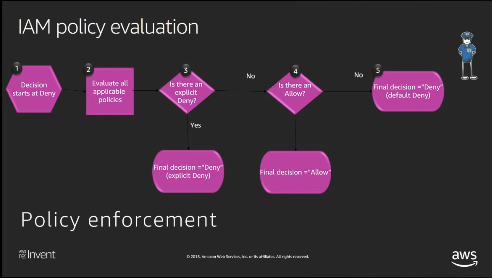

- Security groups and network access control lists (NACLs)
  - Both resource types act as a virtual firewall to protect your network, and they have some similarities, you can achieve the same results with both.
  - the best solution is to use both resource types as virtual firewalls.
  - When traffic enters your network, it is filtered by NACLs before it is filtered by security groups.
  - Security group is the firewall of Instances.
  - Network ACL is the firewall of the VPC Subnets.
    
    Security Groups  | Network Access Control List (NACL)
    ------------      | -------------
    Security groups has to be assigned explicitly to the instance.  | Applicable at the subnet level
    Security groups are stateful: This means any changes applied to an incoming rule will be automatically applied to the outgoing rule. e.g. If you allow an     incoming port 80, the outgoing port 80 will be automatically opened. | Network ACLs are stateless: This means any changes applied to an incoming rule will not be applied to the outgoing rule. e.g. If you allow an incoming port 80, you would also need to apply the rule for outgoing traffic.
    Security group support allow rules only (by default all rules are denied) | Network ACL support allow and deny rules.
    All rules in a security group are applied | Rules are applied in their order (the rule with the lower number gets processed first) in Network ACL.
    Security group is second layer of the defense for inbound/ingress traffic |  Network ACL first layer of defense for inbound/ingress traffic.
    Security group first layer of defense for outbound/egress traffic |  Network ACL is second layer of the defense for outbound/egress traffic.
    Instance can have multiple Security groups | Subnet must have only one NACL
   
- IAM
  - Each IAM user name is unique and case-insensitive. 
  - IAM policy structure follows **PARC** model - **P**rinciple **A**ction **R**esource **C**ondition
    - **Principle** The entity that is allowed or denied access - "Principal":"AWS":"arn:aws:iam::123456789012:user"
    - **Action** Type of action allowed or denyed - "Action":"s3:GetObject"
    - **Resource** The amazon resource(s) that will act upon - "Resource": "arn:aws:s3:::DOC-EXAMPLE-BUCKET/*"
    - **Condition** The condition under action defined is valid - "Condition" : { "{condition-operator}" : { "{condition-key}" : "{condition-value}" }} e.g { "StringEquals" : { "aws:username" : "johndoe" }}
   
 
